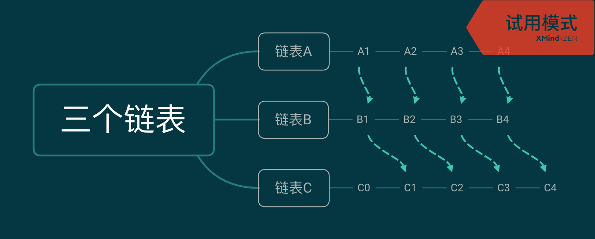

# Add Two Numbers
[# 2](https://leetcode.com/problems/add-two-numbers/)

## 思路1
由于已经帮你把原来的数字存在链表中，并且反转过了，下面进行加法运算的时候较为简单

1. 从个位开始遍历，取值加起来，并保存到新的链表中
2. 对新的链表进行满10进1

## 代码1（本人最初）

```java
class Solution {

    public ListNode addTwoNumbers(ListNode l1, ListNode l2) {

        ListNode p1 = l1;
        ListNode p2 = l2;
        ListNode p3 = new ListNode(0);
        ListNode start = p3;
        int x,y;
        while(p1!=null || p2!=null){
            if(p1==null)
                x=0;
            else
                x=p1.val;
            if(p2==null)
                y=0;
            else
                y=p2.val;
            p3.val = x+y;
            if(p1!=null)
            p1=p1.next;
            if(p2!=null)
            p2=p2.next;
            if(p1!=null || p2!=null){
                ListNode tmp = new ListNode(0);
                p3.next=tmp;    
                p3=p3.next;
            }

        }

        ListNode p4=start;
        while(p4!=null){
            if(p4.val>=10){
                int tmp = p4.val;
                int a = tmp % 10;
                int b = tmp/10;
                p4.val = a;
                if(p4.next!=null)
                    p4.next.val+=b;
                else
                {
                    ListNode newNode = new ListNode(0);
                    p4.next=newNode;
                    p4.next.val+=b;
                }
            }
            p4=p4.next;
        }

        return start;
    }
}
```
可以看到，我写得非常麻烦，因为不得不考虑到各种细节问题，比如两个链表长度不同，只存在一个结点的链表之类的问题等。在编写过程中，由于指针为null导致的runtime error也非常非常多

## 思路2
1. 新建一个结点start，为null，当作之后调用的链表头指针
2. cur指针指向它，进行链表的扩充
3. carry表示求当前位的和时，之前位满10进1的总数
3. **每次根据两个链表的对应结点求出值后，赋给cur的下一个结点，cur从0开始，最后调用的时候直接start.next。这样由于刻意的错开安排，可以避免一些循环设计上的麻烦，使代码更加简介，如下图所示**
4. 最后还要考虑：当最后一位，相加进一，还需要再另开一个结点，值为carry


## 代码2
```java
class Solution {

    public ListNode addTwoNumbers(ListNode l1, ListNode l2) {

        ListNode p1 = l1;
        ListNode p2 = l2;
        ListNode start = new ListNode(0);
        ListNode cur = start;
        int carry=0;

        while(p1!=null || p2!=null){
            int x = (p1==null)?x=0:p1.val;
            int y = (p2==null)?y=0:p2.val;
            int sum = x+y+carry;
            if(p1!=null) p1=p1.next;
            if(p2!=null) p2=p2.next;
            carry= sum/10;
            cur.next = new ListNode(sum%10);
            cur = cur.next;

        }

        if(carry !=0) cur.next=new ListNode(carry);
        return start.next;
    }
}
```
这比原来简介多了。个人认为核心就在于第三个链表从0开始，故意和之前的链表“错开”，从而便于循环体程序的书写，减少了像代码1中的大量代码冗余
