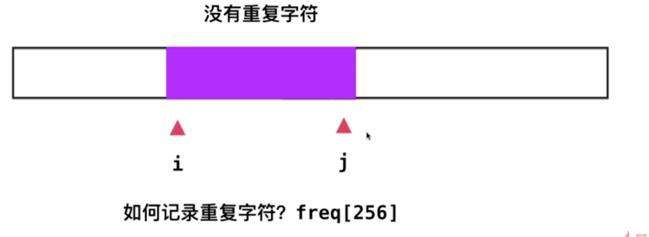

# 3. Longest Substring Without Repeating Characters
[# 3](https://leetcode.com/problems/longest-substring-without-repeating-characters/)

## 思路
这里我采用了“滑动窗口”的模型，见下图


* 右边的指针不断向右移动，如果不重复就停下来，重复就让做指针右移，直到做指针跳过那个重复的元素后，有指针继续右移。这些过程中，循环体每次都会记下当前字串的长度，并保留最大的
* freq[]数组用来记录每个字符存在的次数，从而进行判重处理

## 代码

**两组代码类似，区别在于后者保证[l,r]区间内的子串是不重的，前者保证[l,r)区间内的子串是不重的**
```java
class Solution {
    public int lengthOfLongestSubstring(String s) {
        int l=0,r =0;
        int res=0;
        int[] freq= new int[256];

        while(r<s.length()){
            if(freq[s.charAt(r)]==0)
                freq[s.charAt(r++)]++;
            else
                freq[s.charAt(l++)]--;
            res=Math.max(r-l,res);
        }
        return res;
    }
}
```

```java
class Solution {
    public int lengthOfLongestSubstring(String s) {
        int l=0, r=-1;
        int[] freq= new int[256];
        int res=0;

        while(r+1<s.length()){
            if(freq[s.charAt(r+1)]==0)
                freq[s.charAt(++r)]++;
            else
                freq[s.charAt(l++)]--;
            res=Math.max(res,r-l+1);
        }

        return res;
    }
}
```
