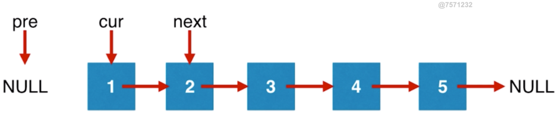
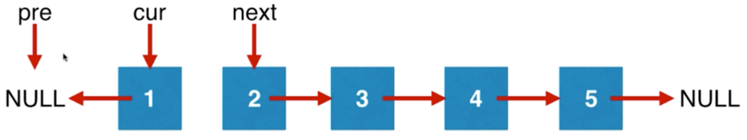
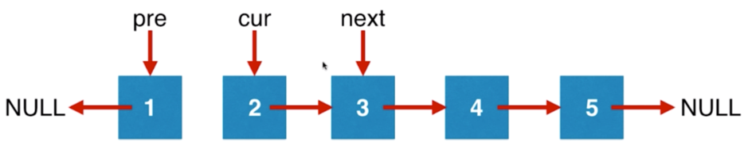

# 反转链表
[leetcode #206](https://leetcode-cn.com/problems/reverse-linked-list)

## 指针的理解
Java语言表示的结构体如下
```Java
public class ListNode {
    int val;
    ListNode next;
    ListNode(int x) { val = x; }
}
```
val 表示结点的值，next 则表示它所连接的下一个点
这里没有指针，可以视作一个引用

## 反转过程




如图所示
1. 新建三个引用，pre，cur，next
2. cur对应的结点所引用的下一个结点反转
3. pre后移，cur后移，next后移

## 代码1
```Java
class Solution {
    public ListNode reverseList(ListNode head) {
        ListNode pre = null;
        ListNode curr =  head;
        ListNode nextTemp;
        if(curr!=null)
        nextTemp = curr.next;
        else
            nextTemp = null;
        while(curr!=null){
            curr.next = pre;
            pre = curr;
            curr = nextTemp;
            if(nextTemp!=null)
            nextTemp =  nextTemp.next;
        }
        return pre;
    }
}
```

这是我的思路，实现起来代码略微复杂，因为有很多可能造成空指针的地方需要判断

## 代码2
```java
class Solution {
    public ListNode reverseList(ListNode head) {
        ListNode pre = null;
        ListNode curr =  head;
        while(curr!=null){
            ListNode nextTemp = curr.next;
            curr.next = pre;
            pre = curr;
            curr = nextTemp;            
        }
        return pre;
    }
}
```
这是网上的代码，大致思路一致，具体操作中有顺序的不同，避免了next带来的困扰
1. 先把pre，curr初始化
2. 在循环中初始化next（循环条件判断了curr是否空，省去了代码1中的的判断）
3. 反转curr引用的结点的引用
4. pre后移
5. cur后移
6. 循环未结束则再次初始化next
6. 当cur已经空了，说明到头，循环结束
7. 返回pre

## 特别注意

这里第二个代码抓住了两个问题

next的问题，就是它是根据curr来的，curr不能是NULL。

同时整个反转过程的结束也是curr指向NULL时。

因此curr作为循环判断条件最为合适。Next也没必要刚开始就设置好，可以在curr确定不为NULL后再进行赋值。它处于pre，curr之后，可以在前两者移动好以后直接重新生成，不需要也进行初始化，并进行“移动”。而前两者没法在每次循环中直接生成，因为链表是单向的，因此需要进行“移动”

三个引用存在的意义

1. 这里pre的存在用来当作反转的”目标”

2. curr的存在用来操控结点连接的目标，以及作为pre后移的目标

3. next的存在用来作为curr后移的目标
